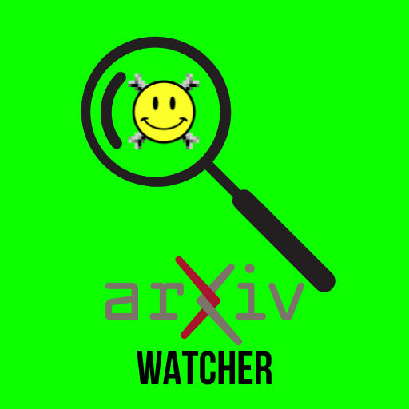
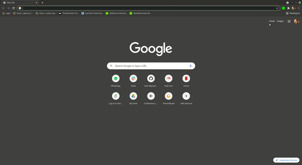
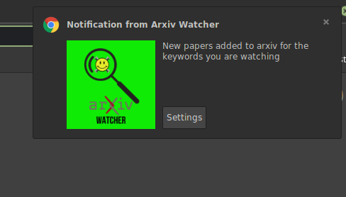

# Arxiv Watcher

<p align="center">
  
</p>
## Do you find it tedious to constantly check arxiv for newly added papers for the research topic you are working on?

Not anymore!!!

**Arxiv Watcher** is a chrome extension which allows you to add the specific keyword you wish to track and notifies you whenever a new paper is added to the arxiv relevant to the keywords you have added.


<p align="center">
    
</p>

Not only does this extension shows the latest papers added, but it checks arxiv in background at specific intervals and notifies the users whenever a new paper is added. Like this,


<p align="center">
    
</p>

# How to use

The extension is still in development stages. Soon it will be published on the chrome web store.

For now to use and test this extension, clone this repo and then run the following commands:

```
npm install
npm run build
```

This will generate a `./dist` folder in the root directory of the repository. Now, 
1. open Google Chrome
2. go to **Settings -> More Tools -> Extension**
3. Enable **Developer Mode**
4. Click on **Load unpacked**
5. Select the `./dist` folder you just created. 
